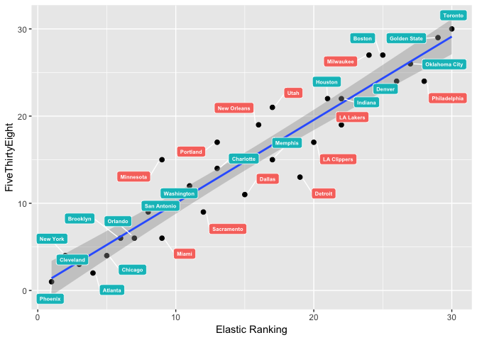
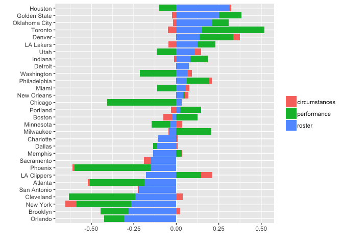

The Golden State Warriors will Three-peat
=========================================

We're roughly 30 games into the 2018–2019 season and it's the perfect time to run the Elastic NBA Ratings and analyze the results. What else could be more important?

If you're not familiar with the Elastic NBA Ratings, here's the short version: the ratings are based on a statistical model that predicts the winner of future match-ups using variables such as team performance, the quality of the roster, and circumstances (travel, home court advantage, etc). For more details, see this [readme file](https://github.com/klarsen1/NBA_RANKINGS).

The Results
-----------

The chart below shows team ranks based on predicted win-rates the Elastic model as well as the [FiveThirtyEight model](https://projects.fivethirtyeight.com/2019-nba-predictions/). The green labels indicate cities where the two models are in agreement (within 2 ranks), and the red labels denote disagreements of three ranks or more.

``` r
library(dplyr)
library(ggrepel)
library(tidyr)

 
f <-
  "https://raw.githubusercontent.com/klarsen1/NBA_RANKINGS/master/rankings/rankings_2018-12-13.csv"
 
all_rankings <- read.csv(f) %>%
  mutate(elastic_ranking=min_rank(season_win_rate),
         FiveThirtyEight=min_rank(pred_win_rate_538),
         absdiff=ifelse(abs(elastic_ranking-FiveThirtyEight)>2, 0, 1)) %>%
  select(team, conference, division, elastic_ranking, FiveThirtyEight, absdiff) %>%
  arrange(elastic_ranking)
 
ggplot(all_rankings, aes(x=elastic_ranking, y=FiveThirtyEight)) +
  xlab("Elastic Ranking") + ylab("FiveThirtyEight") +
  geom_point(size = 2, color = 'black') +
  geom_smooth(method='lm') + 
  geom_label_repel(aes(elastic_ranking, FiveThirtyEight, label = team, fill=factor(absdiff)),
                  fontface = 'bold', color = 'white', size=2,
                  box.padding = unit(0.35, "lines"),
                  point.padding = unit(0.5, "lines")) + 
  theme(legend.title = element_blank()) + theme(legend.position="none")
```



The models agree that Toronto and Golden State are two best teams in the NBA. If we believe these predictions, the best guess right now is that these two teams will meet in the finals. But who will win the match-up and take home the Larry O'Brien trophy? If we go by the chart above, and add the fact that Toronto has won both games against Golden State this season, we'd have to go with Toronto. But there's more to it than this. In fact, when digging deeper into the predictions, a different picture emerges.

Decomposing the predictions
---------------------------

In order to understand why the Elastic Ranking model is favoring Toronto over Golden State, we can decompose the contributions to the model predictions into three parts:

-   Roster -- archetype allocation deficits/surpluses. This group of variables reflects the quality of the roster.

-   Current performance -- trailing win percentages, previous match-ups.

-   Circumstances -- e.g., travel, rest, home-court advantage.

The code below shows how to plot the decomposition of the playoff predictions:

``` r
library(dplyr)
library(ggplot2)
library(tidyr)

f <-
  "https://raw.githubusercontent.com/klarsen1/NBA_RANKINGS/master/modeldetails/score_decomp_2018-12-13.csv"
 
center <- function(x){return(x-median(x))}
d <- read.csv(f, stringsAsFactors = FALSE) %>%
  select(selected_team, roster, circumstances, performance) %>%
  group_by(selected_team) %>%
  summarise_each(funs(mean)) %>% ## get averages across games by team
  mutate(order=roster) %>%
  arrange(order) %>%
  ungroup() %>%
  mutate_each(funs(center), which(sapply(., is.numeric))) %>% ## standardize across teams
  gather(modelpart, value, roster:performance) %>% ## transpose
  rename(team=selected_team)

ggplot(data=d, aes(x=reorder(team, order), value)) + geom_bar(aes(fill=modelpart), stat="identity") + coord_flip() +
  xlab("") + ylab("") + theme(legend.title = element_blank())
```



The bars show the normalized contribution from each part of the model. A value close to zero can be considered average and longer postive bars indicate above average scores. Here are the takeaways:

-   Toronto is the best team right now, but the decomposition shows that their top rating is mainly coming from the team's performance this season. This could mean that Toronto is punching above its weight.

-   Golden State has a better roster than Toronto. But the Dubs are clearly under-performing this season so far -- which is typical for a team coming off two straight championships and four straight finals appearances.

-   Houston has a very strong and balanced roster, but they can't seem to get it together. They're under the 50% mark so far this season.

-   Cleveland is really bad.

The Final Takes
---------------

You know where I'm going with this. If Golden State meets Toronto in the finals, I have no doubt Golden State will win -- barring any major injuries or kicks to the groin. The NBA finals is a different beast than the regular season, and no current team has more experience than Golden State when it comes to playing on the big stage. They'll be motivated and they'll three-peat. In fact, I'd submit that the largest threat to Golden State is a fully functioning Houston team, not Toronto.
