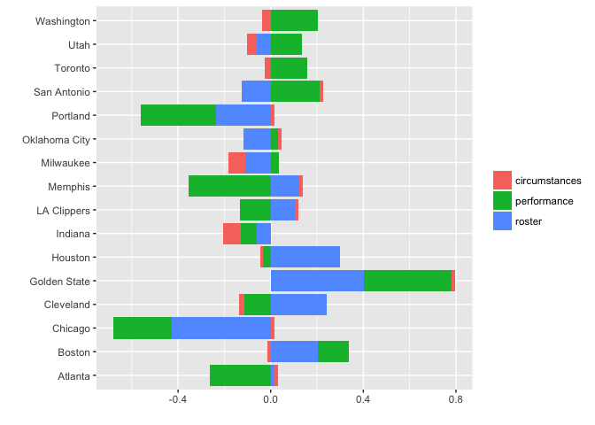

The Winner of the 2017 NBA Playoffs is... The Golden State Warriors!
====================================================================

As we all know, the 2017 NBA playoffs kicked off last weekend. But what you didn't know is that I've attempted to predict the outcome by running the qualifying teams through the playoff tree using the [Elastic NBA Ratings](https://github.com/klarsen1/NBA_RANKINGS).

For those who did not read my previous post on the Elastic NBA Ratings, they are essentially based on a statistical model that predicts the winner of a given match up based team performance, the quality of the roster -- as measured by the surplus of key player *archetypes* -- as well as circumstances (travel, home court advantage, etc).

Let's get straight to the key results:

-   First, a not-so-controversial prediction: The Golden State Warriors will reclaim the title this year. They won in every single simulation, barely losing any games along the way.
-   More interestingly, however, is that the model picks the Boston Celtics as Golden State's opponent in the finals.
-   Also, the model favors the Spurs over Houston to advance to the Western Conference Finals, after a seven game series between the two teams.

Note that this assumes no major injuries to key players (or suspensions).

About the Simulations
=====================

-   No data from the 2017 playoffs were used to make the predictions. Only regular season data were used.
-   For each game, the minutes played by each player were varied randomly, where the level of variation was based on historical data for the 2016-2017 season.
-   I got very similar answers whether I simulated the playoffs 100 or 1,000 times.
-   All injury information is current.
-   The results described in the following section reflect the most commonly occurring outcomes in the simulations.

Should We Trust the Model?
==========================

First of all, we should never completely trust any statistical model. Model predictions should always be combined with a healthy dose of skepticism and common sense.

Having said that, one way to build trust in a model is to demonstrate model accuracy through back-testing. Model accuracy is a necessary -- but not sufficient -- condition for a model to be useful and trustworthy.

When I first did a [backtest](https://github.com/klarsen1/NBA_RANKINGS) of the Elastic Rankings, the accuracy was around 66%. For the first half of the 2016-2017 season, the accuracy was around 63%. Part of the decline in accuracy is due to the fact that the beginning of the season is harder to predict, part of of it is due to reasons that I have not dug into.

Making Sense of the Predictions
===============================

Let's say, for now, that we trust the model. The next questions are then: why does the model favor the Warriors in every simulation? What's the big deal about Boston and why is San Antonio beating the Rockets in the simulations?

To answer these questions, we need to decompose the playoff predictions across all simulations.

Decomposing Predictions into Three Parts
----------------------------------------

As described in the [readme file](https://github.com/klarsen1/NBA_RANKINGS), the R code behind the Elastic Ratings automatically decompose the predictions into three parts:

-   Roster -- archetype allocation deficits/surpluses. This group of variables reflects the quality of the roster.
-   Performance -- e.g., win percentages, previous match-ups.
-   Circumstances -- e.g., travel, rest, home-court advantage

The code below shows how to plot the decomposition of the playoff predictions for all simulations:

``` r
library(tidyr)
library(dplyr)
library(knitr)
library(ggplot2)

f <-
  "https://raw.githubusercontent.com/klarsen1/NBA_RANKINGS/master/modeldetails/2017_playoff_decomp.CSV"
 
center <- function(x){return(x-median(x))}
read.csv(f, stringsAsFactors = FALSE) %>%
  select(selected_team, roster, circumstances, performance) %>%
  group_by(selected_team) %>%
  #inner_join(qualifiers, by="selected_team") %>%
  summarise_each(funs(mean)) %>% ## get averages across games by team
  ungroup() %>%
  mutate_each(funs(center), which(sapply(., is.numeric))) %>% ## standardize across teams
  gather(modelpart, value, roster:performance) %>% ## transpose
  rename(team=selected_team) %>%
  ggplot(aes(team, value)) + geom_bar(aes(fill=modelpart), stat="identity") + coord_flip() +
  xlab("") + ylab("") + theme(legend.title = element_blank())
```



### So What Does this Chart Mean?

The bars show the contribution from each part of the model. Longer, more positive bars mean that the team is stronger in that category compared to their playoff competitors, and vice versa for negative bars. Note that the bars are *relative* to the competitors a given team might meet in the playoff simulations. In other words, the bars are not completely apples-to-apples across teams as some teams will face off against better competition. Nevertheless, we can get some interesting insights from this chart:

-   The red bars show that circumstances -- e.g., traveling and home court advantage -- does not matter much in the playoffs. That's not a big surprise.
-   Golden State gets the highest score of all playoff teams, both in terms of performance (weighted winning percentage) and relative quality of the roster (surplus of stronger player "archetypes""). See the readme file for more details on these metrics. This is essentially why the model always favors Golden State.
-   The model is impressed by San Antonio's ability to beat teams, but not impressed by its roster (compared to the teams they're playing).
-   Based on the green bars, it looks like the model favors Boston over Cleveland due to Cleveland's recent poor performance, despite having a strong roster. But we all know that that the Cavs can turn it up to another level in the playoffs.
-   The model is picking home-court advantage and winning history over roster quality in a potential Rockets/Spurs match-up. In fact, the model is anticipating a seven-games series if this match up happens.

Last Words
==========

We should always be skeptical of statistical models. In fact, sometimes we need to overrule the prediction because we know something that the model doesn't know.

For example, despite what the model says, I think (and hope) we'll see another finals match-up between Golden State and Cleveland. I don't see Boston getting past Cleveland and maybe not even Chicago. Moreover, I wouldn't bet on the Spurs beating the Rockets, despite the better record in the season. The model might be somewhat misled by the Spurs' stellar regular season record.

But the Golden State victory prediction seems like a sure bet, barring any significant injuries or suspensions, of course. No need to doubt the model here.
