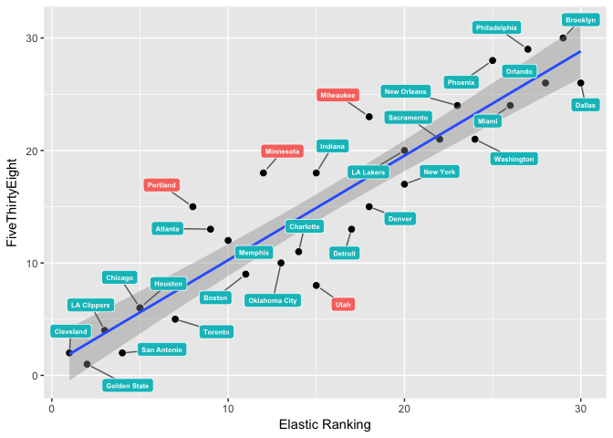
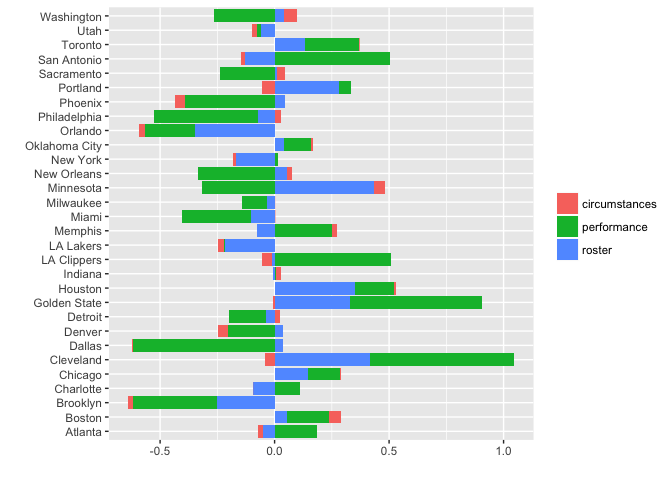
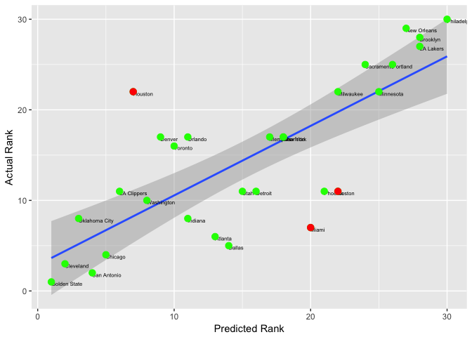
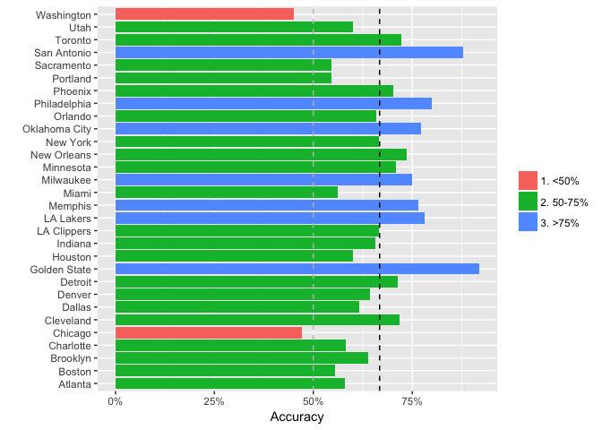

Elastic NBA Rankings
====================

Does the World Really Need Another Statistical Prediction Model?
----------------------------------------------------------------

When Donald Trump won the 2016 presidential election, both sides of the political spectrum were surprised. The prediction models didn't see it coming and the Nate Silvers of the world took some heat for that (although Nate Silver himself got pretty close). After this, a lot of people would probably agree that the world doesn't need another statistical prediction model.

So, should we turn our backs on forecasting models? No, we just need to revise our expectations. George Box once reminded us that statistical models are, at best, useful *approximations* of the real world. With the recent hype around data science and "money balling" this point is often overlooked.

What *should* we then expect from a statistical model? A statistical model should help us process the many moving parts that often affect a given outcome -- such as an election -- by providing a single prediction for the future. It does this by combining the multitude of inputs, assumptions, trends and correlations with a simplified representation of how the world works. The human mind cannot do this and that is what makes models so valuable. However, if the inputs are bad even a good model is going to be wrong. Moreover, no model predicts the unthinkable unless unthinkable assumptions are made.

Forecasting and Basketball
--------------------------

So what does this have to do with basketball? In many ways, basketball is a perfect case study for forecasting. The outcome of future games are affected by many different factors; a team's current performance, momentum, the strength of its roster compared to its opponents, as well as the travel schedule. If a team looks great on paper and it's winning games, it'll likely do well in the future. But factors like injuries, coaching changes, and trades can curtail success very quickly. Thus, any model-based prediction is only accurate until something happens that is unaccounted for in the model.

This post discusses a new data-driven approach to predicting the outcome of NBA games. I call this the *Elastic NBA Rankings*. If you love statistics, R *and* basketball, then this is the post for you.

While it's certain that the model is wrong -- all models are -- I'm hoping that it will also be useful.

Summary -- What You Need to Know About the Elastic NBA Rankings
---------------------------------------------------------------

The Elastic NBA Team Rankings is based on statistical modeling techniques frequently used across various industries to predict bankruptcy, fraud or customer buying behavior. No qualitative data or judgment is used to decide the ranks or the importance of different variables; the only human judgment applied is the underlying framework behind the algorithm.

At a high level, the model depends on three overall factors:

-   Previous performance.
-   How the team looks on paper. This is measured by the roster composition of "player archetypes."
-   Circumstances -- e.g., traveling, rest days, home-court advantage.

The team rankings produced by this model mainly agree with other prediction models (such as FiveThirtyEight) -- at least when it comes to identifying the strong teams and the weak teams (the "tail teams"). There are some interesting differences, such as different rankings of the Portland Trail Blazers, which I will analyze later in this post.

Back testing for the 2015-2016 season showed promising results (see more details below), although I have not done any historical benchmark testing against other models. Time will be the judge.

### What Does the Model Actually Predict?

The model predicts the outcome of future NBA games for the current season. It does not predict the points scored, only the probability of a given team winning.

### Where to Find the Model Predictions

All rankings and scores can be found in [this github repo](https://github.com/klarsen1/NBA_RANKINGS).

The easiest way to read the predictions with, for example, R is to directly read the raw CSV files: <https://raw.githubusercontent.com/klarsen1/NBA_RANKINGS/master/rankings> (see R examples below).

The predictions will be updated weekly with a new time-stamp.

There are two main files of interest:

-   game\_level\_predictions\_YYYY-MM-DD.csv -- Game-level predictions for each future game.
-   rankings\_YYYY-MM-DD.csv -- team rankings and predicted win rates.

In addition, the [modeldetails directory](https://github.com/klarsen1/NBA_RANKINGS/tree/master/modeldetails) has information on the underlying details of the model. See more details below on how to use this data.

How the Model Works
-------------------

The model is based on a three-step procedure:

1.  Create 25 data-driven *archetypes* using [k-means clustering](https://en.wikipedia.org/wiki/K-means_clustering) based on game-level box score statistics from games prior to the 2016-2017 season. The goal of the clustering algorithm is to minimize differences between players *within* clusters (in terms of offensive and defensive stats), while maximizing differences *between* clusters. Players are mapped to a given cluster based on their recent performance, which means that players can change archetype if their box score statistics change.
2.  The winner of a given game is predicted based on team archetypes, home-court advantage, rest days, miles traveled, previous match-ups between the two teams (during that season), as well as recent win percentages.
3.  Teams are ranked based on the predicted win rate for the season. Hence the ranking is schedule-dependent.

Why is the model called "Elastic NBA Rankings?" There are two reasons for this: first, the model automatically adapts as the season progresses. Second, the regularization technique used to fit the logistic regression model is a special case of the [Elastic Net](https://en.wikipedia.org/wiki/Elastic_net_regularization).

### Some Notes on the Model Used in Step 2

The model used to predict the winner of a given game is a statistical model that is estimated based on the most recent three seasons. Hence, the relative importance (weights) of the various drivers -- for example, the importance of roster features versus win percentages -- are purely based on the relationships detected from the data. For the stats-minded readers, the model is a regularized logistic regression using [glmnet](https://cran.r-project.org/web/packages/glmnet/glmnet.pdf) (this worked best in back-testing). V-fold cross-validation was used to choose the penalty parameter.

The model is re-estimated every single day and contains the following variables:

-   Roster composition -- surplus/deficit of minutes allocated to the different archetypes. For example, if a team's lineup has more players on the court of archetype 1 than its opponent, it'll have a surplus of minutes allocated to that archetype, and vice versa.
-   Trailing 90 day winning percentages -- the model assigns less importance to win-streaks early in the season. Moreover, the model assigns higher importance to wins where the opponent has a high [CARM-ELO](http://fivethirtyeight.com/features/how-our-2015-16-nba-predictions-work/) score.
-   Previous match-up outcomes -- for example, let's say Golden State is playing the Clippers and the two teams have played each other earlier in the season. This variable captures the outcomes of those two games. A team is more likely to win if it beat its opponent in the past.
-   Distances traveled prior to the game -- traveling the day before games usually translates into weaker performances, holding everything else constant.
-   Rest days prior to games -- more rest is beneficial during the long NBA season.
-   Home-court advantage.

### More Details on the Archetype Surplus/Deficit Variables

For a given match-up, the following variables are created (made-up example)

<table style="width:136%;">
<colgroup>
<col width="22%" />
<col width="27%" />
<col width="29%" />
<col width="19%" />
<col width="37%" />
</colgroup>
<thead>
<tr class="header">
<th align="left">Archetype</th>
<th align="left">Team 1 Allocation</th>
<th align="left">Team 2 Allocation</th>
<th align="left">Difference</th>
<th align="left">Coefficient (importance)</th>
</tr>
</thead>
<tbody>
<tr class="odd">
<td align="left">Archetype 1</td>
<td align="left">10%</td>
<td align="left">15%</td>
<td align="left">-0.05</td>
<td align="left">-2</td>
</tr>
<tr class="even">
<td align="left">Archetype 2</td>
<td align="left">5%</td>
<td align="left">5%</td>
<td align="left">0</td>
<td align="left">-1.5</td>
</tr>
<tr class="odd">
<td align="left">.</td>
<td align="left">.</td>
<td align="left">.</td>
<td align="left">.</td>
<td align="left">.</td>
</tr>
<tr class="even">
<td align="left">Archetype 25</td>
<td align="left">10%</td>
<td align="left">5%</td>
<td align="left">0.05</td>
<td align="left">2.5</td>
</tr>
</tbody>
</table>

These difference-variables are then directly entered into the logistic regression model (labeled as share\_minutes\_cluster\_XX in the regression model output). The model then estimates the importance of each archetype -- i.e., the *coefficients* shown in the right-most column. Hence, for team 1's roster to be considered strong, compared to team 2, it must have a surplus of minutes allocated to archetypes with large and positive coefficients, and vice versa for archetypes with negative coefficients.

### How Are Players Assigned to Archetypes?

The outcome of the [k-means clustering](https://en.wikipedia.org/wiki/K-means_clustering) routine is 25 *centroids* where each centroid represents the box score profile of an archetype. Players are assigned to archetypes by matching their offensive and defensive box score statistics to closest centroids using the Euclidean distance, and hence can switch archetypes at any given time. A decay function was applied such that more recent games receive a larger weight. In addition, games played in the previous season are discounted by a factor of 4 (before the coefficients are estimated).

### Predicting Allocation of Minutes for Future Games

In order to calculate the deficit and surplus variables referenced above, it's necessary to predict how many minutes each player will play. Currently, a 90-day trailing average is used (excluding the off-season). Games played during the prior season are discounted by a factor of 4 (before the coefficients are estimated).

### Deciding the Winner of a Game

The current implementation uses the estimated probabilities from the regularized logistic regression model to pick the winner of a given game. If the estimated probability of a given team winning exceeds 50%, then that team is declared the winner.

I've also been experimenting with a simulation approach where each game is "re-played" 1000 times, varying the distribution of minutes across archetypes in each iteration. For the overall aggregate rankings this did not alter the overall conclusion, although it did provide a better measure of prediction uncertainties. For example, for the 2015 validation, the model predicted that Golden State would have won *all* its games (see example below). A simulation approach would have done a better job incorporating uncertainty, and so I might still end up going with that.

For simulation playoffs I have been using the simulation approach due to the uncertainty introduced by the hierarchical playoff tree. This will be covered in another post.

Model Rankings for the 2016-2017 Season
---------------------------------------

All model rankings and results are stored in [this github repo](https://github.com/klarsen1/NBA_RANKINGS). The code below shows how to extract the current rankings and compare to the [FiveThirtyEight win/loss predictions](http://projects.fivethirtyeight.com/2017-nba-predictions/). The folks at FiveThirtyEight do amazing work and so this seems like a good sanity check.

Note that the rankings file stored github repo has three key columns:

-   ytd\_win\_rate -- this is the year-to-date win rate for the season.
-   future\_win\_rate -- this is the predicted win rate for future games.
-   season\_win\_rate -- this combines the predicted games with the games that have been played. This is the statistic I'm using to rank teams in the example below.

``` r
library(tidyr)
library(dplyr)
library(knitr)
library(ggrepel) ## downloaded from github

 
f <-
  "https://raw.githubusercontent.com/klarsen1/NBA_RANKINGS/master/rankings/rankings_2016-11-27.csv"
 
all_rankings <- read.csv(f) %>%
  mutate(elastic_ranking=min_rank(-season_win_rate),
         FiveThirtyEight=min_rank(-pred_win_rate_538),
         absdiff=ifelse(abs(elastic_ranking-FiveThirtyEight)>4, 0, 1)) %>%
  select(team, conference, division, elastic_ranking, FiveThirtyEight, absdiff) %>%
  arrange(elastic_ranking)
 
kable(select(all_rankings, conference, division, team, elastic_ranking, FiveThirtyEight))
```

| conference | division  | team          |  elastic\_ranking|  FiveThirtyEight|
|:-----------|:----------|:--------------|-----------------:|----------------:|
| East       | Central   | Cleveland     |                 1|                2|
| West       | Pacific   | Golden State  |                 2|                1|
| West       | Pacific   | LA Clippers   |                 3|                4|
| West       | Southwest | San Antonio   |                 4|                2|
| East       | Central   | Chicago       |                 5|                6|
| West       | Southwest | Houston       |                 5|                6|
| East       | Atlantic  | Toronto       |                 7|                5|
| West       | Northwest | Portland      |                 8|               15|
| East       | Southeast | Atlanta       |                 9|               13|
| West       | Southwest | Memphis       |                10|               12|
| East       | Atlantic  | Boston        |                11|                9|
| West       | Northwest | Minnesota     |                12|               18|
| West       | Northwest | Oklahoma City |                13|               10|
| East       | Southeast | Charlotte     |                14|               11|
| East       | Central   | Indiana       |                15|               18|
| West       | Northwest | Utah          |                15|                8|
| East       | Central   | Detroit       |                17|               13|
| West       | Northwest | Denver        |                18|               15|
| East       | Central   | Milwaukee     |                18|               23|
| West       | Pacific   | LA Lakers     |                20|               20|
| East       | Atlantic  | New York      |                20|               17|
| West       | Pacific   | Sacramento    |                22|               21|
| West       | Southwest | New Orleans   |                23|               24|
| East       | Southeast | Washington    |                24|               21|
| West       | Pacific   | Phoenix       |                25|               28|
| East       | Southeast | Miami         |                26|               24|
| East       | Atlantic  | Philadelphia  |                27|               29|
| East       | Southeast | Orlando       |                28|               26|
| East       | Atlantic  | Brooklyn      |                29|               30|
| West       | Southwest | Dallas        |                30|               26|

``` r
ggplot(all_rankings, aes(x=elastic_ranking, y=FiveThirtyEight)) +
  xlab("Elastic Ranking") + ylab("FiveThirtyEight") +
  geom_point(size = 2, color = 'black') +
  geom_smooth(method='lm') + 
  geom_label_repel(aes(elastic_ranking, FiveThirtyEight, label = team, fill=factor(absdiff)),
                  fontface = 'bold', color = 'white', size=2,
                  box.padding = unit(0.35, "lines"),
                  point.padding = unit(0.5, "lines")) + 
  theme(legend.title = element_blank()) + theme(legend.position="none")
```



The table shows that the elastic rankings generally agree with FiveThirtyEight -- at least when it comes to the "tail teams." For example, all rankings agree that Golden State, Cleveland and the Clippers will have strong seasons, while Philadelphia and New Orleans will struggle to win games.

But what about Portland? The elastic model ranks Portland seventh in terms of season win percentage, while FiveThirtyEight ranks Portland at number 13 (as of 2016-11-27). To understand why the elastic model is doing this, we can decompose the predictions into three parts:

-   Roster -- archetype allocation deficits/surpluses. These are the variables labeled "share\_minutes\_cluster\_XX" described above. This group of variables reflects the quality of the roster.
-   Performance -- e.g., win percentages, previous match-ups.
-   Circumstances -- e.g., travel, rest, home-court advantage

Here's how this works: the underlying predictive variables were multiplied by their respective coefficients, and then aggregated to get the group contributions to the predicted log-odds. The CSV file called score\_decomp\_2016\_MM\_DD contains this information. The code below shows how to use this file:

``` r
library(tidyr)
library(dplyr)
library(knitr)
library(ggplot2)

f <-
  "https://raw.githubusercontent.com/klarsen1/NBA_RANKINGS/master/modeldetails/score_decomp_2016-11-27.csv"
 
center <- function(x){return(x-median(x))}
read.csv(f, stringsAsFactors = FALSE) %>%
  select(selected_team, roster, circumstances, performance) %>%
  group_by(selected_team) %>%
  summarise_each(funs(mean)) %>% ## get averages across games by team
  ungroup() %>%
  mutate_each(funs(center), which(sapply(., is.numeric))) %>% ## standardize across teams
  gather(modelpart, value, roster:performance) %>% ## transpose
  rename(team=selected_team) %>%
  ggplot(aes(team, value)) + geom_bar(aes(fill=modelpart), stat="identity") + coord_flip() +
  xlab("") + ylab("") + theme(legend.title = element_blank())
```



The bars show the contribution from each part of the model. As expected, circumstances do not affect the overall prediction for the entire season as most teams have similarly taxing schedules. However, contributions from performance (weighted winning percentages) and roster (surplus of important archetypes) vary considerably.

First, let's take a look at Portland: the model likes Portland's chances because it thinks its roster is strong relative to its opponents' rosters -- although performance has not been stellar so far.

Next, let's look at Cleveland and Golden State. The model ranks these two teams at the top, both in terms of rosters and performance. In fact, my playoff simulations have these two teams meeting again in the finals and going to seven games (more on that in a later post).

Last, but not least, let's take a look at San Antonio and the Timberwolves -- two teams that are viewed very differently by the model. According to the model, San Antonio has been over-performing. The model does not like how the roster looks on paper, yet performance has been strong so far. This could be due to strong coaching, "corporate knowledge" (as Gregg Popovich calls it) and team chemistry -- factors that the roster component of the model does not capture. Minnesota, on the other hand, is under-performing according to the model; the roster is rated highly compared to its opponents, but the team is not performing well. This could be due to inexperience.

Backtesting
-----------

The model was used to predict all games from 2015-11-20 to the end the 2015-2016 season, using only information available as of 2015-11-19 (including model coefficients). This is roughly a five month forecast window (the season ends in April); most teams played around 70 games during this period.

The game level accuracy (using 50% as the probability cutoff to declare winners) for the entire period was 65.8% -- i.e., the model predicted the correct winner for 65.8% of games.

The [area under the ROC curve](https://en.wikipedia.org/wiki/Receiver_operating_characteristic) -- generated by comparing the estimated probabilities to the win/loss indicator -- was 0.744.

The code below compares the actual rankings to the predicted rankings (note that this table only covers the games played after 2015-11-19):

``` r
library(dplyr)
library(knitr)
library(ggplot2)
library(ggrepel) ## downloaded from github

f <-
  "https://raw.githubusercontent.com/klarsen1/NBA_RANKINGS/master/rankings/ranking_validation_2015.csv"
 
ranks <- read.csv(f) %>% select(team, rank_actual, rank_pred) %>%
  mutate(diff=abs(rank_pred-rank_actual), 
         misslvl=ifelse(diff>10, 1, ifelse(diff<5, 2, 3))) %>%
  arrange(rank_pred) 

ggplot(ranks, aes(x=rank_pred, y=rank_actual)) +
  xlab("Predicted Rank") + ylab("Actual Rank") +
  geom_point(size = 2, color = 'black') +
  geom_smooth(method='lm') + 
  geom_label_repel(aes(rank_pred, rank_actual, fill = factor(misslvl), label = team),
                  fontface = 'bold', color = 'white', size=2,
                  box.padding = unit(0.35, "lines"),
                  point.padding = unit(0.5, "lines")) + 
  theme(legend.title = element_blank()) + theme(legend.position="none")
```



The predicted team rankings were also in line with the actual team rankings, except for some significant differences (e.g., Miami or Boston). There might be good reasons why the model misjudged these teams from a ranking perspective, given the fact that the predictions were made only 11 games into the season. More investigation needed here.

Next, let's check the *game-level* match-rates for the predictions (a match here means that the model correctly predicts the winner of the game using the 50% probability cutoff). The chart below shows the game-level accuracy for each team. The vertical lines show the overall match rate (65.8%) as well as the match rate we would get from a random draw (50%):

``` r
library(dplyr)
library(knitr)
library(scales)
source("https://raw.githubusercontent.com/klarsen1/NBA_RANKINGS/master/functions/auc.R") 

f <-
  "https://raw.githubusercontent.com/klarsen1/NBA_RANKINGS/master/rankings/game_level_validation_2015.csv"

game_level <- read.csv(f, stringsAsFactors = FALSE)

overall_match_rate=mean(as.numeric(game_level$selected_team_win==game_level$d_pred_selected_team_win))
 
mutate(game_level, match=as.numeric(selected_team_win==d_pred_selected_team_win)) %>%
  mutate(overall_match_percent=mean(match)) %>%
  rename(team=selected_team) %>%
  group_by(team) %>%
  summarise(team_match_percent=mean(match)) %>%
  mutate(miss=ifelse(team_match_percent<.5, "1. <50%", 
                     ifelse(team_match_percent<=.75, "2. 50-75%", "3. >75%"))) %>%
  ggplot(aes(team, team_match_percent, fill=factor(miss))) + geom_bar(stat="identity") + coord_flip() +
  xlab("") + ylab("Accuracy") + theme(legend.title = element_blank()) + 
  geom_hline(yintercept = overall_match_rate, linetype=2, color='black') +
  geom_hline(yintercept = .5, linetype=2, color='grey') +
  scale_y_continuous(labels = scales::percent)
```



``` r
print(paste0("AUROC = ", AUC(game_level$selected_team_win, game_level$prob_selected_team_win_d)[1]))
```

    ## [1] "AUROC = 0.744458919137388"

Note that the model is most accurate for the "tail teams" such as Golden State and Philadelphia, which is to be expected. There are a some teams where the model completely missed the mark -- such as Chicago and Washington -- but overall is the model is doing fairly well considering length of the forecast window.

Future Development
------------------

### Dealing With Injuries and Trades

As mentioned previously, the model depends on rosters *and* previous performance. If a team executes a major mid-season trade, the roster component will react immediately (I scrape the injury list and return dates daily) while the performance component will be slower to react (based on a 90 day window). There are a number of ways around this, but currently no special treatment is being applied.

### Player Interaction

The model currently does not capture any interaction between the archetypes. I have tested basic two-way interaction terms, but that did not help much. More work is needed here.

### Schedule-independent Team Rankings

Currently, the model ranks teams by predicting win rates. This means that, holding everything else constant, the rankings implicitly favor teams that play in weaker divisions. A future development could be to have two rankings: one that predicts the win rate given the current schedule (this is what the model is currently doing), and one that normalizes for schedule differences.

### Uncertainty

As stated above, the model uses a deterministic approach to decide the winner. If the win-probability estimated by the logistic regression model exceeds 50% for a given team, that team is chosen as the winner. As a result, the model can be somewhat extreme in its predictions. For example, the model believes that Golden State will win almost every future game -- when in reality they'll' likely lose some unexpected games. Having a better sense of uncertainty would could create more realistic win rate predictions for tail teams.
